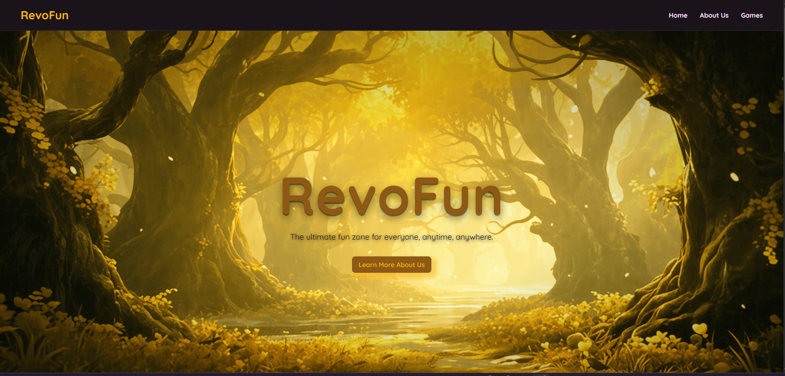
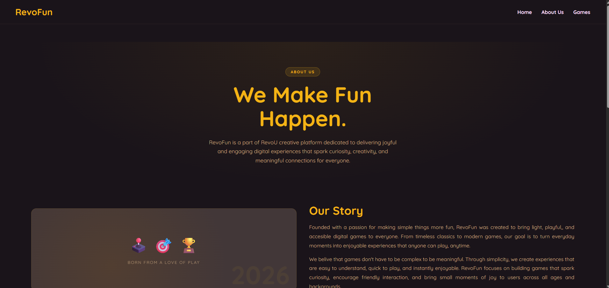
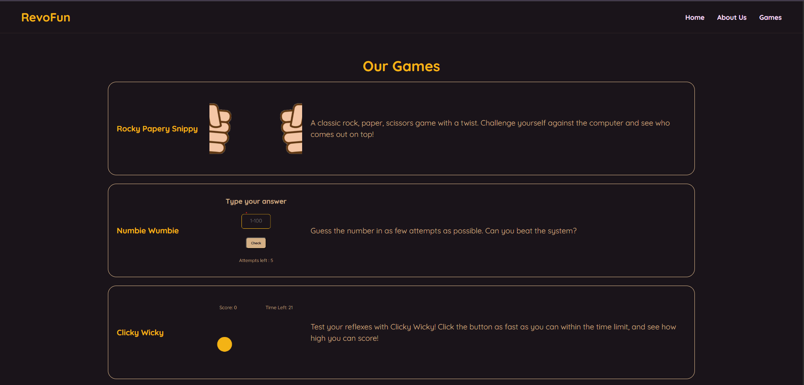

# Overview 🎮
RevoFun is a web-based mini game platform, created to deliver fun dan interactive digital experiences for users. The website features several simple games with responsive layouts, playful designs, and engaging gameplay mechanics. This project was built using CSS, and JavaScript, then deployed through GitHub Pages.

# Features Implemented
Link of demo: https://drive.google.com/file/d/1n0kn8xpJFv25MUiHKaevHAJ4gqwa8qoY/view?usp=sharing
- Home pages: shows a brief introduction to RevoFun, some of the games, and a feedback-form to get in touch with the dev.

- About Us pages: shows a background detail about RevoFun, including their story, vision, mission, and what their real target is.

- Games pages: shows all of the games that was created by RevoFun. User can play all of their games by clicking the game's card.

- Others:
    - Responsive multi-page website design
    - Game rules page before gameplay start
    - Dynamic score tracking and game logic using JavaScript.
    - Navigation system between pages.
    - Interactive buttons and hover animations.
    - Custom styling with CSS.
    - Auto-generated current year in the footer using JavaScript.

# Technologies Used 🧑‍💻
- Frontend: HTML, CSS, JavaScript
- Backend: -
- Deploy: GitHub Pages
- Link URL: https://revou-fsse-feb26.github.io/milestone-2-MicelHiu/